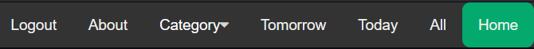

# Web Engineering

## Technical Report

## ToDo-Webapp

By: Marvin Samouelian, Nick Obereiter and Martin Hofsäß

# Table of contents

## 1. Planning
### 1.1. Target definition
### 1.2 Choice of frameworks + Tech Stack
### 1.3. Division of responsibilities

## 2. Implementation and showcase
### 2.1. Key functions
### 2.2. A simple showcase of the ToDo-Webapp
### 2.3. Routing Structure

# 1. Planning

# 1.1. Target definition

The program should allow different users to login into their existing accounts, create new accounts and recover their password if necessary.

Visibility of content should be connected to authentication status of the user.

The main functionality should allow the user to create ToDo's with different topics and should be sortable by these. Delete said ToDo's or edit their parameters such as: Name, due date…

Functionality of the application should be accessible via dedicated pages as well as via a comprehensive dashboard, which also should implement useful evaluation and analysis tools.

Further functionality could comprise of:

Mailing services to Account E-Mail, when a ToDo is about to expire.

The page design should be fully responsive.

Further statistics and services displayed and accessible through the dashboard or new pages.

# 1.2. Choice of frameworks + Tech Stack

As all of us had more or less comprehensive experience in web development, we decided to use technologies and frameworks which we were less or not proficient at all, as to challenge us a bit more.

Thus our decisions fell on React-JS and CSS for the frontend of our web application. For the backend we chose to use Pocketbase, as it would fill in for everything our backend would be comprised of.

Pocketbase functions as the whole backend of our web application in that it supplies a database, an authentication system, file storage and holds our backend logic as a Go framework.

### Tech Stack
- React JS
- Pocketbase / Go
- 

# 1.3. Division of responsibilities

| Login Page | Nick Obereiter |
| --- | --- |
| Registration Page | Nick Obereiter |
| Reset Password Page | Nick Obereiter |
| Home/Home | Martin Hofsäß / Nick Obereiter |
| Home sub functionality | Martin Hofsäß / Nick Obereiter |
| Create ToDo | Marvin Samouelian |
| ToDo overview Page | Marvin Samouelian |
| ToDo tomorrow Page | Marvin Samouelian |
| ToDo today Page | Marvin Samouelian |
| Topics Page | Nick Obereiter |
| Login/Registration Logic | Marvin Samouelian |
| Database | Marvin Samouelian |
| Backend | Marvin Samouelian |
|
|
|
| Project Documentation | Martin Hofsäß |

# 2. Implementation and showcase

# 2.1. Key functions

- Functioning Server and Database via Pocketbase.
- Working Account-Management via Pocketbase.
- Fully reactive design.
- Create, edit and delete ToDo's
- 

# 2.2. A simple showcase of the ToDo-Webapp

The user arrives at the login screen and enters his login credentials.

After successfully authenticating he will be greeted on his home-site/dashboard and gets a comprehensive overview of all important information in relation to his existing ToDo's.

The user decides to create a new ToDo. For this he can use the button in the bottom right of every page.

The Navigation Bar at the top of the screen allows the user to navigate between the different sites.

# 2.3. Routing structure

[Routing_Structure.drawio](Routing_Structure.drawio)